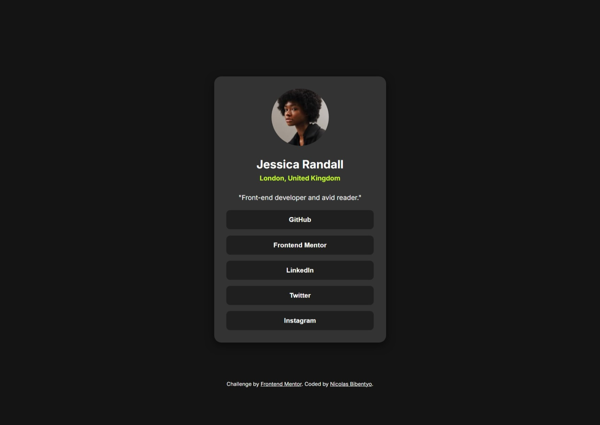

# Frontend Mentor - Social links profile solution

## Table of contents

- [Overview](#overview)
  - [Screenshot](#screenshot)
  - [Links](#links)
- [My process](#my-process)
  - [Built with](#built-with)
  - [What I learned](#what-i-learned)
  - [Useful resources](#useful-resources)
- [Author](#author)


## Overview

This is my solution to the [Social links profile challenge on Frontend Mentor](https://www.frontendmentor.io/challenges/social-links-profile-UG32l9m6dQ). Frontend Mentor challenges help me improve my coding skills by building realistic projects. 

### Screenshot



### Links

- Solution URL: (https://github.com/Nicolas-Ohlin/Social-links-profile.git)
- Live Site URL: (https://nicolas-ohlin.github.io/Social-links-profile/)

## My process
-Analyse the page
-Extract the HTML structure
-Write HTML first
-Style the page with css
-Debug with AI (copilot)

### Built with

- Semantic HTML5 markup
- Pure CSS 
- Flexbox

### What I learned

Use of css min , max and clamp functions.

```css
body {
  padding: clamp(20px, 5vw, 70px);
  background-color: var(--Grey-900);
  font-family: 'Inter', sans-serif;
  color: var(--White);
  margin: 0;
  -webkit-font-smoothing: antialiased;
  -moz-osx-font-smoothing: grayscale;
}

```
### Useful resources

- [resource 1](https://youtu.be/2IV08sP9m3U) - This helped me for understanding some CSS fucntions like min(),clamp(),...

## Author
- Frontend Mentor - [@Nicolas-Ohlin](https://www.frontendmentor.io/profile/Nicolas-Ohlin)

